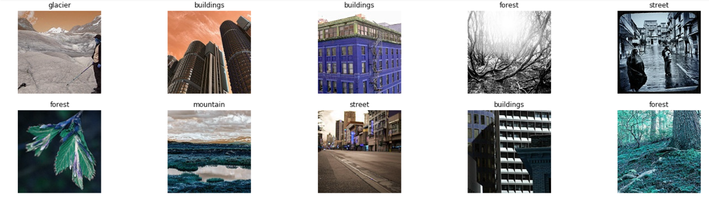

## Dataset 

**Intel Image (from Kaggle):** around 25k colorful images of size 150x150.  
**Six classes:** Buildings, Forest, Glacier, Mountain, Sea, and Street.

 

## Building CNN from scratch using Keras

## Transfer learning with VGG-16 using Keras

## Transfer learning with VGG-16 using PyTorch

## Conclusion  

[back](https://github.com/743048072/Wendy-Zhai/)
